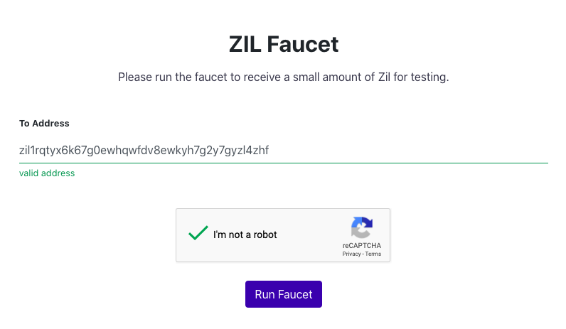

---
## Testnet Faucet via Nucleus Wallet

In order to deploy a contract to Zilliqa's testnet and send transactions, you will need testnet $ZIL in your account.

Enter the your wallet address on nucleus wallet's faucet website, you will receive 300 testnet $ZIL once the transaction is confirmed.

The faucet is accessible at [https://dev-wallet.zilliqa.com/faucet](https://dev-wallet.zilliqa.com/faucet)

## Source Code

If you are interested in looking into the implementation of the faucet, you can access the GitHub repository can be found at [https://github.com/Zilliqa/nucleus-wallet](https://github.com/Zilliqa/nucleus-wallet)